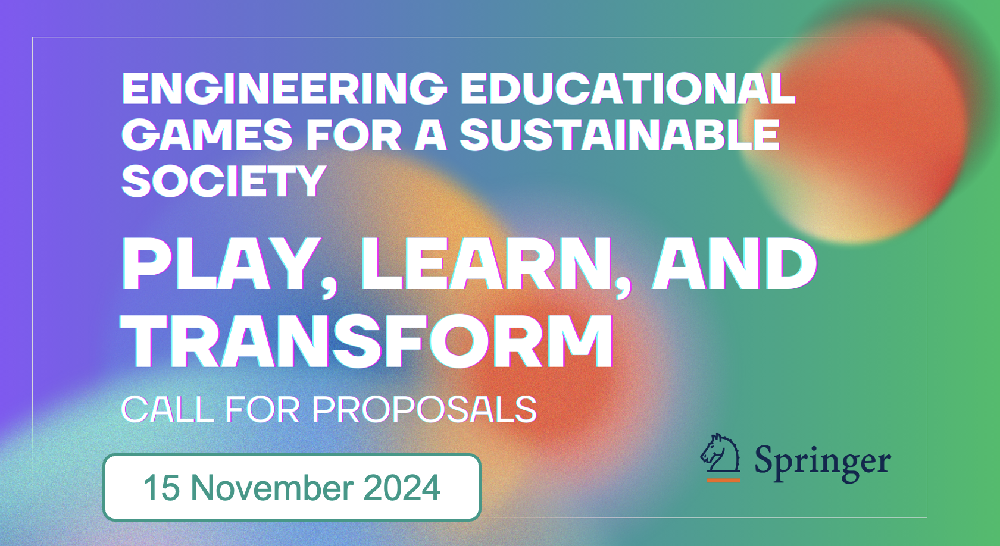

<header>
    
</header>

    <section class="intro">
        <h1>Chapters Preparation and Submission Guidelines</h1>
        <h2><b>BookTitle:</b> Engineering Educational Games for a Sustainable Society: Play, Learn, and Transform (EEG4SS_2025)</h2>
        
<strong>Editors:</strong>

        <ul>
            <li>Antonio Bucchiarone - Fondazione Bruno Kessler (FBK) Trento, Italy</li>
            <li>Valentina Rossi - Swiss Federal Institute of Technology in Lausanne (EPFL), Switzerland</li>
            <li>Vanissa Wanick - University of Southampton, UK</li>
        </ul>
    </section>
    <section class="section-logos">
        
        
        
    </section>
    <section class="section-logos">
        <h3>Important Deadlines</h3>
        <ul>
            <li><strong>Abstract Submission:</strong> November 15, 2024</li>
            <li><strong>Notification of Acceptance:</strong> December 8, 2024</li>
            <li><strong>Full Chapter Submission:</strong> January 31, 2025</li>
            <li><strong>Review and Feedback:</strong> March 10, 2025</li>
            <li><strong>Final Version Submission:</strong> April 30 , 2025</li>
            <li><strong>Book Delivery Date:</strong> June 15, 2025</li>
        </ul>
    </section>
    <section class="content">
    

        <h2>Submission Procedure</h2>
        
Authors are invited to submit their full <strong>chapter</strong> by <strong>January 31st, 2025</strong>. Manuscripts submitted for the book must be original, must not be previously published, or currently under review anywhere. Submitted manuscripts should respect the standard guidelines of the <strong>Springer</strong> chapter format.

Manuscripts must be prepared using <strong>LaTeX</strong> or <strong>Word</strong>, and according to the manuscript preparation guidelines, following the link below:

        

            <a href="https://www.springer.com/gp/authors-editors/book-authors-editors/your-publication-journey/manuscript-preparation" target="_blank">Springer Manuscript Preparation Guidelines</a>
        

        
Chapters should contain between <strong>15-25 pages</strong>. Manuscripts that do not follow the formatting rules will be rejected without review.

        
<strong>Submission System:</strong> All chapters must be submitted using the <strong>EasyChair</strong> system as a unique PDF document. Please use the following link to submit your manuscript:

        

            <a href="https://easychair.org/" target="_blank">EasyChair Submission System</a>
        

        
<strong>NB:</strong> There are <strong>no submission or acceptance fees</strong> for manuscripts submitted to this book for publication. All manuscripts are accepted based on a <strong>single-blind peer review</strong> editorial process.

    

</section>

    <section class="intro">
        <h1>Call for Chapters</h1>
        <h2><b>BookTitle:</b> Engineering Educational Games for a Sustainable Society: Play, Learn, and Transform (EEG4SS_2025)</h2>
        
<strong>Editors:</strong>

        <ul>
            <li>Antonio Bucchiarone - Fondazione Bruno Kessler (FBK) Trento, Italy</li>
            <li>Valentina Rossi - Swiss Federal Institute of Technology in Lausanne (EPFL), Switzerland</li>
            <li>Vanissa Wanick - University of Southampton, UK</li>
        </ul>
    </section>
    <section class="section-logos">
        
        
        
    </section>
    <section class="section-logos">
        <h3>Important Deadlines</h3>
        <ul>
            <li><strong>Abstract Submission:</strong> November 15, 2024</li>
            <li><strong>Notification of Acceptance:</strong> November 30, 2024</li>
            <li><strong>Full Chapter Submission:</strong> January 15, 2025</li>
            <li><strong>Review and Feedback:</strong> March 1, 2025</li>
            <li><strong>Final Version Submission:</strong> April 15, 2025</li>
            <li><strong>Book Delivery Date:</strong> May 30, 2025</li>
        </ul>
    </section>
    <section class="content">
        <h2>Introduction</h2>
        
The aim of this book is to provide models, methods, tools, and experiences to engineer games that <i><b>foster learning and solve societal and environmental problems</b></i>. This essential resource for educators, scientists, and engineers in academia and industry explores innovative approaches to game development, emphasizing practical solutions and transformative learning experiences. By integrating the latest research and hands-on applications, this book seeks to inspire and guide the creation of educational games that lead to impactful change.

        <h2>Book Objectives and Themes</h2>
        
The objective of this book is to explore the multifaceted role of games in contemporary education and society. <u><b><i>We expect contributions for themes 1 to 5 (see below) from experts and researchers in the field</i></b></u>, while the introduction and conclusion will be managed by the book editors to ensure a cohesive and comprehensive narrative. This collaborative approach will enable a thorough examination of <i><b>how games can revolutionize education, foster community engagement, and promote sustainability</b></i>. By bringing together diverse perspectives and insights, this book aims to highlight the transformative potential of games in driving educational and social progress.

        <h3>[Introduction] The Role of Games in Contemporary Society</h3>
        
This theme introduces the foundational importance of games in both <i><b>learning and driving social change</b></i>. It examines how games are integral to engineering education and their broader societal impacts. It provides an overview of the book's objectives and themes, setting the stage for the in-depth discussions that follow. Through this lens, the theme highlights the transformative power of games, emphasizing their significance in contemporary educational and social contexts.

        <h3>Theme 1: Understanding Playful Learning</h3>
        
This theme explores the transformative impact of game-based learning on engineering education. It covers the essential role of games in enhancing student engagement and problem-solving skills, the potential of the metaverse for immersive learning experiences, the benefits of collaborative worldbuilding projects, and <i><b>the effectiveness of games in driving behavioral change</b></i>. Through <i><b>theoretical insights and practical examples</b></i>, this theme highlights innovative strategies for integrating games into engineering curricula to foster a dynamic and interactive learning environment.

        ➡️
For this theme, we welcome submissions on the areas of student engagement, problem-solving skills, metaverse-based learning, collaborative worldbuilding, behavioral change through games, innovative game-based strategies in engineering education, and more.

        <h3>Theme 2: Educational Approaches and Applications in Higher Education</h3>
        
This theme focuses on innovative strategies for enhancing engineering education through playful and user-centered learning experiences. This section examines the integration of playful learning into educational practices, the customization of learning experiences through game-based approaches, and <i><b>the design of serious games to address educational goals</b></i>. Additionally, it explores <i><b>how games can promote sustainability</b></i> and systems thinking in engineering education. Through <i><b>case studies, methodological guidelines, and scientific evidence</b></i>, this section provides a comprehensive look at how games can revolutionize higher education by making learning more engaging, personalized, and impactful.

        ➡️
For this theme, we welcome submissions on the areas of playful learning integration, game-based learning customization, serious game design, sustainability promotion through games, systems thinking in engineering education, innovative game-based strategies in higher education, and more.

        <h3>Theme 3: Innovative and Emerging Technologies for Game Design</h3>
        
This theme delves into cutting-edge advancements and experimental methodologies in game development. It explores <i><b>the critical role of experimentation in game design, the impact of generative AI on creating dynamic game content</b></i>, and the <i><b>ethical considerations surrounding AI in gaming</b></i>. Additionally, it examines the use of <i><b>tangible and intangible user interfaces</b></i>, enhancing player interaction and immersion. The section also highlights the integration of digital twins and tangible objects in game design, offering new dimensions of interactivity and realism. Through detailed discussions and examples, this section provides a comprehensive overview of the latest innovations shaping the future of game development.

        ➡️
For this theme, we welcome submissions on the areas of experimental game design methodologies, generative AI in game development, ethical considerations of AI in gaming, tangible and intangible user interfaces, player interaction and immersion, integration of digital twins and tangible objects in game design, alternative controllers and more.

        <h3>Theme 4: Participation, Community Strategy, and Sustainability</h3>
        
This theme emphasizes the critical intersections between gaming, community engagement, and sustainable practices. This section explores how communities contribute to game development through collaboration and co-created solutions, illustrated by <i><b>case studies of successful community-driven projects</b></i> within and outside academia. It also examines the role of games in fostering skills to drive sustainable behaviors, highlighting games that educate and promote environmental consciousness. Additionally, the section delves into regenerative practices and nature-based solutions within game design, showcasing <i><b>how games can advocate for and integrate ecological principles</b></i>. Through these discussions, this section underscores the potential of games to drive community involvement toward sustainability.

        ➡️
For this theme, we welcome submissions on the areas of community-driven game development, collaboration in game projects, games fostering sustainability skills, promoting sustainable behaviors, environmental education through games, regenerative practices in game design, integrating nature-based solutions in gaming, and more.

        <h3>Theme 5: Evaluation and Impact</h3>
        
This theme focuses on the methods and metrics used to assess the <i><b>effectiveness of games to validate their learning objectives, particularly in promoting sustainability</b></i>. This section presents how to measure the impact of games using specific metrics and key performance indicators (KPIs), providing <i><b>tools for evaluating the success</b></i> of educational and serious games. It also explores the importance of engaging stakeholders in the development and evaluation process, ensuring their active participation and input. Furthermore, this section highlights how to measure the broader impact of games and their potential to <i><b>influence policy-making</b></i>. Through these insights, this section offers a comprehensive framework for evaluating the impact of games on education, sustainability, and policy.

         ➡️
For this theme, we welcome submissions on the areas of impact assessment methods, metrics and KPIs for games, stakeholder engagement in game evaluation, measuring educational game success, broader impacts of games,  games’ influence on policy-making, and more.

        <h3>[Conclusions]</h3>
        
This part of the book focuses on envisioning the future of game-based learning and development. It explores emerging trends in game-based learning, predicting how these innovations will shape education and societal interactions in the years to come. It also reflects on the potential long-term impacts of games, considering their evolving role in both educational settings and broader social contexts. Through this forward-looking perspective, it underscores the ongoing and future significance of games in driving educational and social progress.

        <h2>Chapter Submission Guidelines</h2>
        
Interested authors are invited to submit these mandatory information <b>by November 15, 2024</b>:

        <ul>
            <li>List of Authors with Affiliations and Contact Information</li>
            <li>Provisional Chapter Title</li>
            <li>Brief Abstract (300-500 words without references): The abstract must include the rationale, research questions, aims and objectives, a summary of expected contributions, the methodology used (if applicable), and references consulted.</li>
            <li>Methodology and Evaluation Criteria (200-300 words): The chapter proposal must include detailed information on the data experiments conducted (if applicable), including the types of data used and the experimental setup, as well as the criteria and metrics employed for evaluating the results.</li>
        </ul>
        <h2>Chapter Submission</h2>
        
Chapters should be submitted by completing the following <a href="https://docs.google.com/forms/d/e/1FAIpQLSeXS0xNSfGCffGLmkDXOH7_EgTpkHHzELoVaPUFOyV8d2GbNg/viewform?usp=sharing">Google Form</a>.

        <h2>Download Call for Chapters PDF</h2>
        

            <a href="https://antbucc.github.io/PE4GenAI/materiale/Cfc.pdf" class="download-link" target="_blank">Download PDF</a>
        

        <h2>Contact Information</h2>
        
For further information or inquiries, please contact: 
        <ul>
        <li><strong>Antonio Bucchiarone</strong> - <a href="mailto:bucchiarone@fbk.eu">bucchiarone@fbk.eu</a></li>
        <li><strong>Valentina Rossi</strong> - <a href="mailto:valentina.rossi@epfl.ch">valentina.rossi@epfl.ch</a></li>
        <li><strong>Vanissa Wanick</strong> - <a href="mailto:vwv1n12@ecs.soton.ac.uk">vwv1n12@ecs.soton.ac.uk</a></li>
        </ul>
       

        
<h2>We look forward to your contributions!</h2>

    </section>

